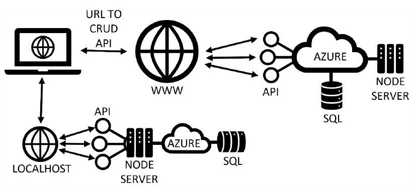

## WebShop API

An API with Controllers and routes for all the tables in the Azure SQL Database. 
Includes CRUD operations for most of the tables in the databse.

**Project Contains:**
* Node.js.
* Express.
* ESLint.
* Nodemon.

